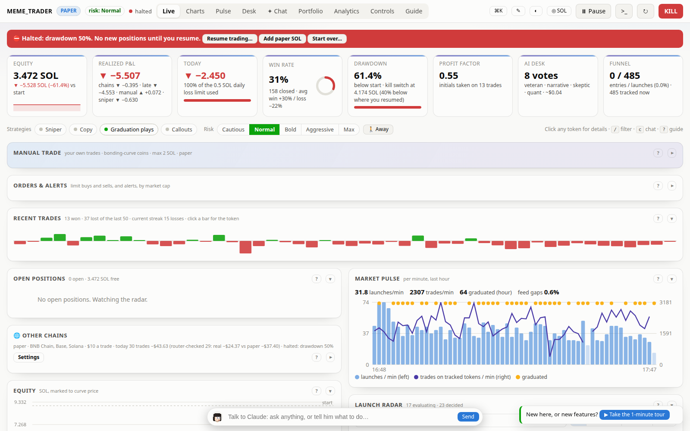
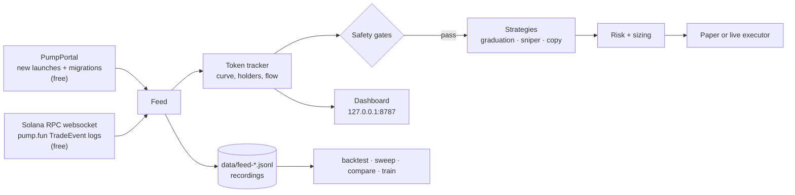
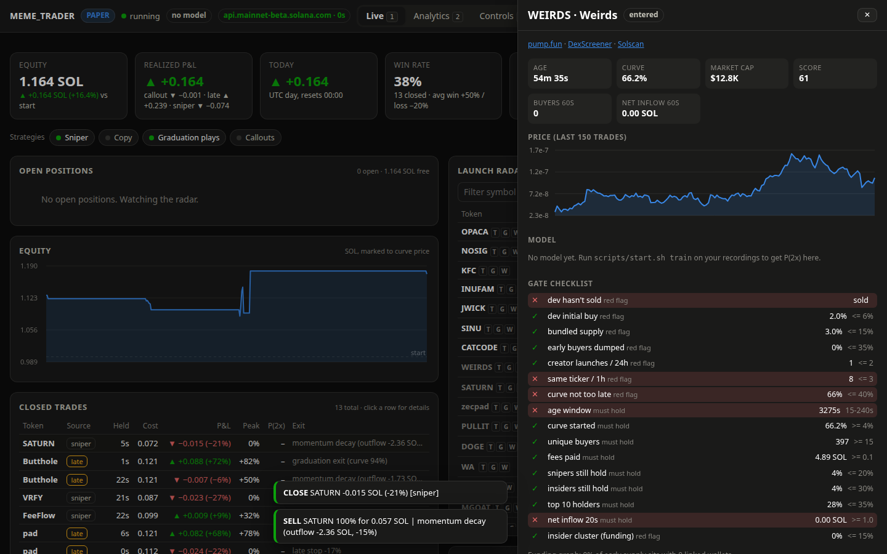
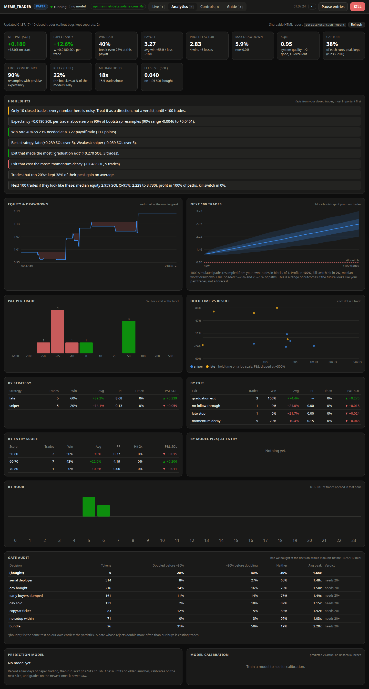

# meme_traderv1

Paper-first memecoin trading bots for **Solana**, in two parts:

- **pump.fun engine** (the main one). It watches every new pump.fun token as it launches and screens out rugs and insider launches. It trades late-curve "graduation plays" and early momentum, and can copy chosen wallets or act on calls from Telegram and X. A live dashboard shows every decision as it happens.
- **DexScreener momentum bot.** It scans trending Solana tokens on DexScreener, any token rather than only pump.fun launches, checks them with RugCheck and a sell-back test, and trades through Jupiter.

[](LICENSE)



<sub>Live view during a real-market paper run (2026-10-03): pretend money, real pump.fun data.</sub>

> **Status: paper trading.** The bot has only been tested with pretend money so far. Most pump.fun tokens go to zero. Nothing here is financial advice. Never trade money you can't afford to lose.

## Results so far

These are paper trades on the **real market**, starting from 1 SOL of pretend money each session. The samples are tiny, so read them as a direction, not a verdict. The full numbers and analysis are in [docs/BUILD_LOG.md](docs/BUILD_LOG.md).

| Session | Data feed | Launches screened | Trades | Win rate | P&L |
|---|---|---|---|---|---|
| 2026-10-02, 48 min | PumpPortal (metered) | 1,959 | 7 | 29% | **+0.136 SOL** (+13.6%) |
| 2026-10-03, 1 h | Solana on-chain logs (free) | 1,465 | 13 | 38% | **+0.164 SOL** (+16.4%) |

By strategy, 2026-10-03:

| Strategy | Trades | Win rate | P&L |
|---|---|---|---|
| Graduation plays | 5 | 60% | +0.239 SOL |
| Early sniper | 6 | 17% | −0.074 SOL |
| $1 callouts | 2 | 50% | −0.001 SOL |

What's known so far:
- **Graduation plays have made the profit in both sessions.** The early sniper hasn't shown an edge yet.
- **About 8% of launches double within minutes.** The hard part is telling them apart from the ~92% that don't. The safety gates reject far more losers than winners: of 574 "serial deployer" rejects, 7% doubled before falling 30%, while 27% fell 30% first.
- **The free on-chain feed is more complete than the paid one.** It had 0 gaps in 10,828 trades, against 20.6% of trades missing or out of order on PumpPortal's stream.

## What it does

- **Sees every launch.** New tokens come from PumpPortal's free stream. Every trade is decoded from pump.fun's own on-chain logs over a Solana websocket. No paid data or API key is needed.
- **Screens for rugs.** It rejects a token if:
  - the creator bought a large share of their own token, or has sold;
  - the creator is a serial deployer, or the ticker is a copycat;
  - insiders bundled the first buys, or early buyers are dumping;
  - wallets in the funding graph form an insider cluster.
- **Trades two main strategies:**
  - **Graduation plays:** strong momentum late on the bonding curve, sold before the token migrates.
  - **Early sniper:** confirms momentum first, then rides it. It doesn't try to win block-0 races against insiders.
  - Optional: **copy trading** of chosen wallets (mirror their buys, or use them as a signal), **Telegram/X call signals** (contract addresses posted in channels you choose), and **$1 callout positions**.
- **Sells after graduation too.** Exits route to the bonding curve or, once a token has migrated, to its PumpSwap pool.
- **Manages risk:**
  - a dollar hard cap per buy, a daily loss limit and a drawdown kill switch;
  - a "defense mode" that halves size after a losing run;
  - position sizing at quarter-Kelly.
- **Measures itself:**
  - expectancy, profit factor and bootstrap confidence in the edge;
  - a gate audit that checks whether each rejection rule costs more than it saves;
  - a calibrated P(2×) prediction model, plus backtests, walk-forward sweeps and A/B comparisons on recorded data.

## How it works



## Quick start

Paper trading on the real market needs **no keys and no wallet**.

```bash
git clone https://github.com/m4n3ce/meme_traderv1.git
cd meme_traderv1
bash scripts/setup_ubuntu.sh        # or: bash scripts/setup_mac.sh
scripts/start.sh doctor             # checks what's set up
scripts/start.sh paper              # real market, pretend money -> http://127.0.0.1:8787
```

Step-by-step guides with screenshots: [Mac](docs/MAC_SETUP.md) · [Ubuntu, including running 24/7 as a service](docs/UBUNTU_SETUP.md).

## Commands

| Command | What it does |
|---|---|
| `scripts/start.sh demo` | Simulated market. Good for learning the dashboard; its P&L means nothing. |
| `scripts/start.sh paper` | Real market, pretend money. Records the feed to `data/`. |
| `scripts/start.sh doctor` | Checks packages, data feeds, keys and wallet. |
| `scripts/start.sh report` | Shareable HTML report + CSV of your trades. |
| `scripts/start.sh backtest` | Replays your recordings with the current settings. |
| `scripts/start.sh sweep --grid exit.stop_loss_pct=20,30,40` | Walk-forward parameter tuning with a noise guard. |
| `scripts/start.sh compare --variant "no_late: late.enabled=false"` | A/B test strategies across recorded days. |
| `scripts/start.sh train` | Fits and grades the P(2×) model on your recordings. |
| `scripts/start.sh leaders` | Ranks wallets in your recordings worth copying. |
| `scripts/start.sh live` | **Real money.** Locked until you complete [SETUP.md step 5](docs/SETUP.md). |

Task recipes are in [docs/HOWTO.md](docs/HOWTO.md).

## Screenshots

| Token detail: every gate, live | Analytics: what's working and what isn't |
|---|---|
|  |  |

## Configuration

- **Settings:** defaults are in [`config/params.example.yaml`](config/params.example.yaml), with every option commented. Put your overrides in `config/params.yaml`, which is git-ignored. The dashboard's **Controls → Save** writes there too.
- **Keys:** go in `.env`; see [`.env.example`](.env.example). All are optional for paper trading:

| Variable | Used for |
|---|---|
| `SOLANA_WS_URL` | Trade data websocket (default: the free public RPC). Use a flat-rate endpoint if you change it: the stream is ~20 GB/day. |
| `ANTHROPIC_API_KEY` | Optional AI trading desk (`--desk`) and post-mortem review agent |
| `TELEGRAM_BOT_TOKEN`, `TELEGRAM_ALERT_CHAT_ID` | Phone alerts for buys, closes and errors |
| `SOLANA_RPC_URL`, `SOLANA_KEYPAIR_PATH`, `MEME_TRADER_CONFIRM_LIVE` | Live trading only |
| `TELEGRAM_API_ID`, `TELEGRAM_API_HASH`, `X_BEARER_TOKEN` | Call signals from Telegram channels / X accounts |
| `JUPITER_API_KEY` | DexScreener bot: realistic paper quotes + sell-back check; required for its live mode |
| `PUMPPORTAL_API_KEY` | Only for the metered PumpPortal trade stream (`sniper.feed.trades: pumpportal`) |

## Going live

Don't, until paper results across several days justify it. When they do, follow [docs/SETUP.md step 5](docs/SETUP.md#5-going-live-real-money):
- use a **dedicated bot wallet** that holds only the budget, never your main wallet;
- use a paid RPC;
- start small.

Live mode is locked behind `--live`, `MEME_TRADER_CONFIRM_LIVE=yes` and a matching keypair. The dashboard's **KILL** button sells everything.

## Documentation

| Doc | Contents |
|---|---|
| [SETUP.md](docs/SETUP.md) | What to connect, costs, and going live safely |
| [MAC_SETUP.md](docs/MAC_SETUP.md) · [UBUNTU_SETUP.md](docs/UBUNTU_SETUP.md) | Illustrated install guides |
| [HOWTO.md](docs/HOWTO.md) | Task recipes and troubleshooting |
| [STRATEGY.md](docs/STRATEGY.md) | Market research, strategy reasoning and sources |
| [BUILD_LOG.md](docs/BUILD_LOG.md) | Every decision, measurement and result, newest first |
| [MULTICHAIN.md](docs/MULTICHAIN.md) | Can it trade other chains? Feasibility, plan and costs (on hold) |

## Project layout

```
meme_trader/sniper/   pump.fun engine: feeds, tracker, strategies, risk, analytics, CLI
meme_trader/ui/       dashboard server + single-page UI
meme_trader/agents/   DexScreener momentum bot: scout, safety, analyst, risk, executor, monitor
config/               params.example.yaml (all settings, commented)
scripts/              setup and start scripts for Mac / Ubuntu
deploy/               systemd service
tests/                pytest suite (92 tests)
```

### DexScreener momentum bot

A separate, simpler bot for **any Solana token**, not only pump.fun launches:
1. A scout pulls fresh and boosted tokens from DexScreener.
2. Safety checks run RugCheck, holder concentration, and a buy-then-sell quote round-trip to catch tokens that can't be sold.
3. An analyst scores momentum, risk sizes the position, and the executor trades through Jupiter.

```bash
cp config/params.example.yaml config/params.yaml   # edit values
python -m meme_trader --once                       # one cycle
python -m meme_trader                              # loop (paper by default)
```

Every decision is written to `data/journal-YYYY-MM-DD.jsonl`. Live mode needs `JUPITER_API_KEY`, a dedicated wallet keypair and `MEME_TRADER_CONFIRM_LIVE=yes`. It runs on live DexScreener and RugCheck data in paper mode, but it's less developed than the pump.fun engine and hasn't had an extended paper run yet.

## Development

```bash
.venv/bin/python -m pytest -q
```

## License

[GPL-3.0](LICENSE). You may use, study, change and share this code. Anything you distribute that's built on it must also be released under GPL-3.0. It comes with **no warranty**: you are responsible for any money you trade with it.
