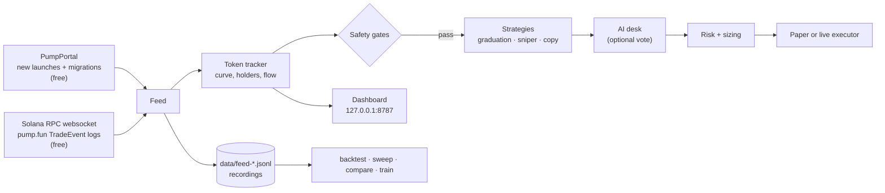
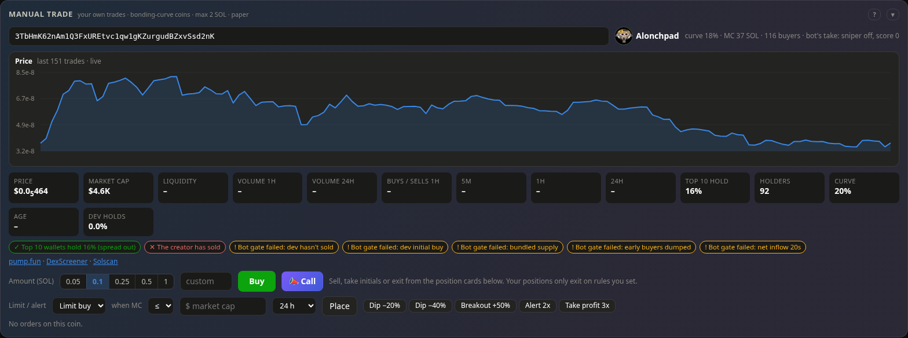

# meme_traderv1

Paper-first memecoin trading bots for **Solana**, in two parts:

- **pump.fun engine** (the main one). It watches every new pump.fun token as it launches and screens out rugs and insider launches. It trades late-curve "graduation plays" and early momentum, and can copy chosen wallets or act on calls from Telegram and X. A live dashboard shows every rule, every setting and every decision as it happens, with AI personas that vote on entries and an edge check that says whether a result is real or luck.
- **DexScreener momentum bot.** It scans trending Solana tokens on DexScreener, any token rather than only pump.fun launches, checks them with RugCheck and a sell-back test, and trades through Jupiter.

[](LICENSE)


<sub>Live view during a real-market paper run (2026-10-05): pretend money, real pump.fun data.</sub>

> **Status: paper trading.** The bot has only been tested with pretend money so far. Most pump.fun tokens go to zero. Nothing here is financial advice. Never trade money you can't afford to lose.

## Results so far

**No trading edge has been proven yet.** The paper bot's own **edge check** (Analytics tab, or `scripts/start.sh edge`) judges each strategy the way a skeptical group would:

| Strategy | Paper trades | Per SOL staked | Average trade (90% range) | Without its best 3 trades | Verdict |
|---|---|---|---|---|---|
| Graduation plays | 162 | **+6.5%** | +7.1% (+0.3% to +14.3%) | +0.39 SOL | promising, not proven |
| Early sniper (now off) | 55 | −13.8% | −13.8% (−17.6% to −9.9%) | −1.71 SOL | losing, not by bad luck |

<sub>Real market, pretend money, 2026-10-03 to 10-04. Fills are modelled: a 2.5 s delay to land, curve fees, and failed orders.</sub>

Why "promising" and not more:
- the best three graduation trades made 92% of its profit, so one missed runner changes the picture;
- it covers only 1.5 days, and the settings changed 8 times in that span;
- a replay of 16 h of earlier development data with realistic order delay **lost** 0.4–1.0 SOL. The two results disagree, which is why a frozen test decides.

**The frozen test.** The research process ([docs/RESEARCH.md](docs/RESEARCH.md)) confirms or rejects one strategy at a time:
- the strategy is written down and frozen first;
- it's judged only on data recorded after freezing;
- the costs are net and measured;
- there are baselines and day-level uncertainty.

`graduation-v1` is collecting its holdout; its verdict is due around 2026-10-17. A second candidate, `wallets-v1`, tests "follow wallets that were early on several runners" on coins at least 14 days old, with its rules registered before any data ([docs/WALLETS.md](docs/WALLETS.md)).

What's known so far:
- **About 8% of launches double within minutes.** The hard part is telling them apart from the ~92% that don't. The safety gates reject far more losers than winners: of 574 "serial deployer" rejects, 7% doubled before falling 30%, while 27% fell 30% first.
- **Completeness isn't enough: a feed must also be on time.** The free on-chain feed was complete, but PublicNode delivered it ~12 s behind the chain; the public RPC is 1–2 s behind. The watchdog checks both and remembers which endpoint was fastest.

## What it does

- **Sees every launch.** New tokens come from PumpPortal's free stream. Every trade is decoded from pump.fun's own on-chain logs over a Solana websocket. No paid data or API key is needed.
- **Screens for rugs.** It rejects a token if:
  - the creator bought a large share of their own token, or has sold;
  - the creator is a serial deployer, or the ticker is a copycat;
  - insiders bundled the first buys, or early buyers are dumping;
  - wallets in the funding graph form an insider cluster.
- **Trades two main strategies:**
  - **Graduation plays:** strong momentum late on the bonding curve, sold before the token migrates.
  - **Early sniper:** confirms momentum first, then rides it. It doesn't try to win block-0 races against insiders.
  - Optional: **copy trading** of chosen wallets, **Telegram/X call signals** (contract addresses posted in channels you choose), and **$1 callout positions**.
- **Lets AI personas vote.** Four personas (veteran, skeptic, narrative, quant) can review every entry the rules pick before it's bought. They run on Claude, or on something cheaper or free:
  - GitHub Models, Hugging Face, OpenRouter;
  - a model on your own machine (Ollama, LM Studio).

  The dashboard shows what a review costs (about 2 cents on Claude Opus) and has a Test button. They also read every note you save, and answer questions like "what's holding us back?" from the bot's real numbers.
- **Manages risk:**
  - one **risk dial** (Cautious to Max) scales trade size, open positions and the daily loss limit together;
  - a dollar hard cap per buy, a daily loss limit and a **drawdown kill switch**;
  - after a halt, **Resume trading** re-measures the kill switch from where you resumed;
  - a "defense mode" that halves size after a losing run;
  - position sizing at quarter-Kelly.
- **Measures itself:**
  - the **edge check**: per strategy, a 90% range, the result without its best 3 trades, and day by day;
  - the **exit lab**: every other exit rule, run in the shadows on the same entries with fees;
  - expectancy, profit factor, and a gate audit that checks whether each rejection rule costs more than it saves;
  - a calibrated P(2×) model, plus backtests, walk-forward sweeps and A/B comparisons on recorded data.
- **Keeps a record nobody can rewrite.** Every 📣 call goes into a hash-chained ledger and is scored after costs at fixed horizons. You can publish the ledger's head to X or Telegram ([EDGE_PROOF.md](docs/EDGE_PROOF.md)).

## Trading by hand

Manual trading is yours: the bot never blocks or resizes your trades.
- **Paste a contract address** (or press Trade on any coin) and the coin's **live price chart** opens with its metrics: price, market cap, liquidity, volume, buys vs sells, holders, dev share, RugCheck and the bot's own red flags.
- **Buy or add, then sell:** sell 25% or 50%, take **Initials**, or **Exit**. Your positions exit only on the stop, take profit or trail you set on each card.
- **Limit orders and alerts by market cap:** buy the dip, sell into strength, or just get pinged. They survive restarts.
- **💡 Tips after your trades.** A small box can appear for:
  - a big share of the account;
  - red flags;
  - a quiet coin;
  - a losing streak;
  - a quick flip that only paid fees (about 6% round trip).

  They never block anything, and you can turn them off.
- **🤖 Hand a position to the bots** (or 🚶 **Away** for all of them). They ride it for a runner:
  - half comes out at 2x;
  - the rest trails 30% off its peak;
  - a stop sits 40% down;
  - there are no time or stall exits.
- **Graduated coins** (Pulse's Graduated column, or a pasted address) trade on paper at their PumpSwap pool price.
- **⚡ Pulse** lists new launches, the final stretch and fresh graduates, with filters and one-click buys.


## How it works



## Quick start

Paper trading on the real market needs **no keys and no wallet**.

```bash
git clone https://github.com/m4n3ce/meme_traderv1.git
cd meme_traderv1
bash scripts/setup_ubuntu.sh        # or: bash scripts/setup_mac.sh
scripts/start.sh doctor             # checks what's set up
scripts/start.sh paper              # real market, pretend money -> http://127.0.0.1:8787
```

Step-by-step guides with screenshots: [Mac](docs/MAC_SETUP.md) · [Ubuntu, including running 24/7 as a service](docs/UBUNTU_SETUP.md).

## Commands

| Command | What it does |
|---|---|
| `scripts/start.sh demo` | Simulated market. Good for learning the dashboard; its P&L means nothing. |
| `scripts/start.sh paper` | Real market, pretend money. Records the feed to `data/`. |
| `scripts/start.sh doctor` | Checks packages, data feeds, keys and wallet. |
| `scripts/start.sh edge` | The edge check in plain text, ready to paste into a group (`--days 14`, `--mode paper`). |
| `scripts/start.sh report` | Shareable HTML report + CSV of your trades (`--mode paper` / `live`; demo, paper and live are never mixed). |
| `scripts/start.sh calls verify` | Checks the call ledger's hash chain (`calls stats`, `calls list` too). |
| `scripts/start.sh backtest` | Replays your recordings with the current settings. |
| `scripts/start.sh sweep --grid exit.stop_loss_pct=20,30,40` | Walk-forward parameter tuning with a noise guard. |
| `scripts/start.sh compare --variant "no_late: late.enabled=false"` | A/B test strategies across recorded days. |
| `scripts/start.sh research eval graduation-v1` | Evaluates a frozen research policy (`data`, `freeze`, `final`, `log`). |
| `scripts/start.sh train` / `promote` | Fits a candidate P(2×) model; deploys it only with skill on unseen launches. |
| `scripts/start.sh leaders` | Ranks wallets in your recordings worth copying. |
| `scripts/start.sh live` | **Real money.** Locked until you complete [SETUP.md step 5](docs/SETUP.md). |

Task recipes are in [docs/HOWTO.md](docs/HOWTO.md).

## The dashboard

- **Tabs:** Live, Pulse, Desk, Calls, Chat, Portfolio, Analytics, Controls, Guide.
  - **Ctrl+K** finds anything: tabs, coins, settings, guide pages.
  - **✎ Arrange** lets you drag, resize and hide any panel.
- **>_ Terminal** (the `` ` `` key): every command, typed.
  - `status`, `pos`, `buy BONK 0.1`, `sell all`, `alert BONK >= 1m`, `limit buy BONK <= 50k 0.1`;
  - `hand all`, `away on`, `risk 2`, `desk on`, `unhalt`, `log 20`, `ask …`.
  - It runs bot commands only, the same as the buttons, never shell commands.
- **↻ Restart** (next to KILL) saves everything, reloads the code and settings, and picks up where it left off.
- **Controls:** every setting, live, with Save. API keys set and tested from the page, with Test buttons for the Anthropic key, the RPC, the websocket and Helius.
- **Desk:** the bots as Habbo-style pixel people in an isometric trading room.
  - The scanner carries coins to the AI table, and the personas vote out loud.
  - The P&L board and the weather in the window follow the day.
  - Edit the room, dress the bots, or click one to see its screen.
- **✦ Chat:** ask Claude about the bot, or paste a contract address for a metrics card. Every action it proposes waits for your Approve. It runs Claude Code headless on your Claude plan, so no API key is needed.

The AI operator's limits live in the bot, not in the prompt:
- it can lower any risk setting, but never raise sizing, positions, the loss limit or the stop loss above your config;
- it can't re-enable a strategy you turned off, switch to live, save risk settings, or press or lift the kill switch;
- paper deposits only, capped per deposit; they count as capital, not profit;
- its buys pass the bot's normal risk checks and are rate-limited;
- every action carries a reason, journaled and shown on the dashboard, and asks you first.

The same tools load in Claude Code from `.mcp.json`:

```bash
cd ~/meme_traderv1 && claude
> /desk-check                     # full review: feed, P&L, positions, radar, analytics -> act or not
```

## Screenshots

| Analytics: the edge check | Trade panel: live chart, metrics, red flags |
|---|---|
|  |  |
| **Desk: the trading room** | **Token detail: every gate, live** |
|  |  |
| **AI desk model: Claude, or cheaper** | **Terminal** |
|  |  |
| **Chat: ask, approve actions, paste a contract address** | |
|  | |

Most screenshots are from the real-market paper bot (pretend money). The terminal and AI-model panel are from the built-in demo (`scripts/start.sh demo`, a simulated market), whose numbers aren't results.

## Configuration

- **Settings:** defaults are in [`config/params.example.yaml`](config/params.example.yaml), with every option commented. Put your overrides in `config/params.yaml`, which is git-ignored. The dashboard's **Controls → Save** writes there too.
- **Keys:** go in `.env` (see [`.env.example`](.env.example)), or set them on the dashboard under **Controls → API keys**. All are optional for paper trading:

| Variable | Used for |
|---|---|
| `SOLANA_WS_URL` | Trade data websocket (default: free public endpoints). The stream is ~20 GB/day: a plan billed by data or credits can run out fast. |
| `SOLANA_RPC_URL` | Lookups, balances, the Portfolio tab and live trading. Helius: `https://mainnet.helius-rpc.com/?api-key=…` (set for you when you save a Helius key). |
| `HELIUS_API_KEY` | Wallet-funding lookups with exchange labels (insider clusters) |
| `ANTHROPIC_API_KEY` | AI desk on Claude, and the post-mortem review agent |
| `GITHUB_MODELS_TOKEN`, `HF_TOKEN`, `OPENROUTER_API_KEY` | AI desk on cheaper or free models (a local Ollama needs no key) |
| `TELEGRAM_BOT_TOKEN`, `TELEGRAM_ALERT_CHAT_ID`, `TELEGRAM_CHANNEL_ID` | Phone alerts, and posting calls and cards to a channel |
| `X_API_KEY`, `X_API_SECRET`, `X_ACCESS_TOKEN`, `X_ACCESS_SECRET` (or `X_CLIENT_ID` / `X_CLIENT_SECRET`) | Posting to X from the dashboard (your own developer app) |
| `TELEGRAM_API_ID`, `TELEGRAM_API_HASH`, `X_BEARER_TOKEN` | Call signals from Telegram channels / X accounts |
| `SOLANA_KEYPAIR_PATH`, `MEME_TRADER_CONFIRM_LIVE` | Live trading only |
| `JUPITER_API_KEY` | DexScreener bot: realistic paper quotes + sell-back check; required for its live mode |
| `PUMPPORTAL_API_KEY` | Only for the metered PumpPortal trade stream (`sniper.feed.trades: pumpportal`) |

`data/agent.token` is created fresh at every start for the AI operator tools. It isn't a setting, and it's readable only by your user.

## Going live

Don't, until paper results across several days justify it. When they do, follow [docs/SETUP.md step 5](docs/SETUP.md#5-going-live-real-money):
- use a **dedicated bot wallet** that holds only the budget, never your main wallet;
- use a paid RPC;
- start small.

Live mode is locked behind `--live`, `MEME_TRADER_CONFIRM_LIVE=yes` and a matching keypair. The dashboard's **KILL** button sells everything. Built-in safeguards:
- each transaction is simulated before signing and refused if it would move more SOL than the order allows;
- an order whose outcome is unclear is looked up on-chain, never blindly re-sent;
- buys reserve their cash before they're sent;
- the ledger is checked against the wallet's real balance;
- only one bot can trade a wallet at a time;
- graduated coins trade on paper only: their price only updates every 10 s after graduation.

These have been tested against simulated failures, not yet with real money.

## Documentation

| Doc | Contents |
|---|---|
| [SETUP.md](docs/SETUP.md) | What to connect, costs, and going live safely |
| [MAC_SETUP.md](docs/MAC_SETUP.md) · [UBUNTU_SETUP.md](docs/UBUNTU_SETUP.md) | Illustrated install guides |
| [HOWTO.md](docs/HOWTO.md) | Task recipes and troubleshooting |
| [STRATEGY.md](docs/STRATEGY.md) | Market research, strategy reasoning and sources |
| [RESEARCH.md](docs/RESEARCH.md) | How a strategy is frozen, evaluated and judged (and what's been found) |
| [WALLETS.md](docs/WALLETS.md) | The wallet study: rules, data sources and their limits, timeline |
| [EDGE_PROOF.md](docs/EDGE_PROOF.md) | Proving an edge to a group: the call ledger, honest scoring, publishing proofs, and a plan for splitting into repos |
| [OPEN_SOURCE_NOTES.md](docs/OPEN_SOURCE_NOTES.md) | What open-source trading bots on GitHub do, which ones are bait, and what we took |
| [BUILDS_RESEARCH.md](docs/BUILDS_RESEARCH.md) | The best "agents in a room" builds (Pixel Agents, Habbo engines, Axiom) and what the trading room took from them |
| [BUILD_LOG.md](docs/BUILD_LOG.md) | Every decision, measurement and result, newest first |
| [MULTICHAIN.md](docs/MULTICHAIN.md) | Can it trade other chains? Feasibility, plan and costs (on hold) |

## Project layout

```
meme_trader/sniper/   pump.fun engine: feeds, tracker, strategies, risk, AI desk, edge check, exit lab, CLI
meme_trader/ui/       dashboard server + single-page UI, keys, posting to X / Telegram
meme_trader/agents/   DexScreener momentum bot: scout, safety, analyst, risk, executor, monitor
meme_trader/wallets/  the wallet study recorder and evaluation
research/policies/    frozen research policies (one file per idea)
config/               params.example.yaml (all settings, commented)
scripts/              setup and start scripts for Mac / Ubuntu
deploy/               systemd services
tests/                pytest suite (288 tests)
```

### DexScreener momentum bot

A separate, simpler bot for **any Solana token**, not only pump.fun launches:
1. A scout pulls fresh and boosted tokens from DexScreener.
2. Safety checks run RugCheck, holder concentration, and a buy-then-sell quote round-trip to catch tokens that can't be sold.
3. An analyst scores momentum, risk sizes the position, and the executor trades through Jupiter.

```bash
cp config/params.example.yaml config/params.yaml   # edit values
python -m meme_trader --once                       # one cycle
python -m meme_trader                              # loop (paper by default)
```

Every decision is written to `data/journal-YYYY-MM-DD.jsonl`. Live mode needs `JUPITER_API_KEY`, a dedicated wallet keypair and `MEME_TRADER_CONFIRM_LIVE=yes`. It runs on live DexScreener and RugCheck data in paper mode, but it's less developed than the pump.fun engine and hasn't had an extended paper run yet.

## Development

```bash
.venv/bin/python -m pytest -q
```

## License

[GPL-3.0](LICENSE). You may use, study, change and share this code. Anything you distribute that's built on it must also be released under GPL-3.0. It comes with **no warranty**: you are responsible for any money you trade with it.
