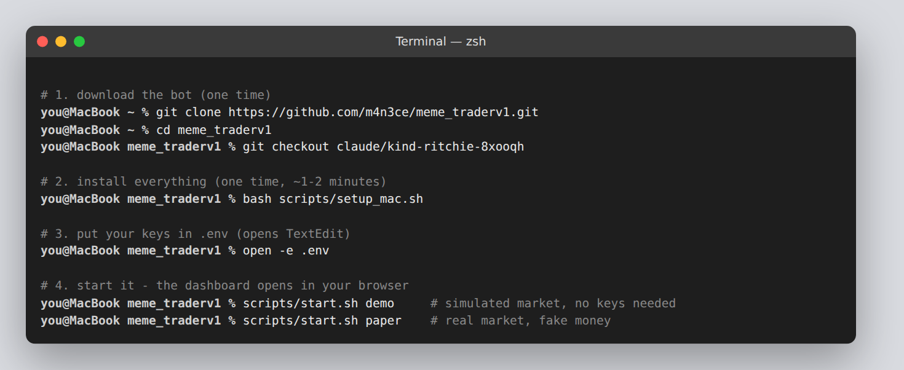
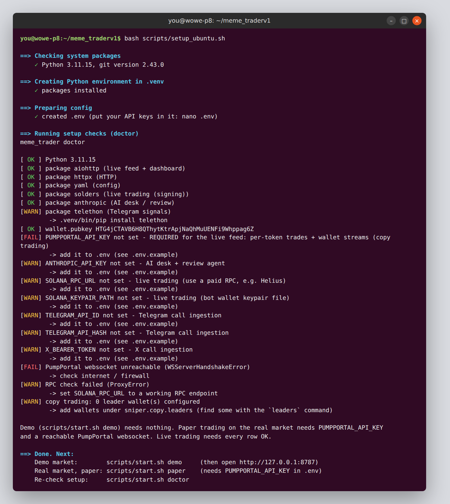
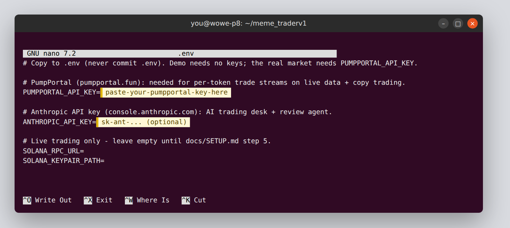

# Mac setup (step by step)

About 10 minutes the first time. You'll type a few commands into **Terminal**. Copy and paste them exactly.

> **The short version:** open Terminal, paste the 4 lines from step 2, put your key in `.env` (step 4), then double-click **Start Demo** (step 5).



---

## 1. Open Terminal
Press **⌘ Cmd + Space**, type **Terminal**, press **Enter**.

## 2. Download and install the bot
Paste these lines into Terminal and press Enter:

```bash
cd ~
git clone https://github.com/m4n3ce/meme_traderv1.git
cd meme_traderv1
git checkout claude/kind-ritchie-8xooqh      # skip this line once the branch is merged into main
bash scripts/setup_mac.sh
```

What the setup script does:
- It checks for Apple's developer tools (they provide `git`). **If a window pops up asking to install "Command Line Tools", click Install.** Wait for it to finish (5–10 min), then paste the last line (`bash scripts/setup_mac.sh`) again.
- It finds Python 3.10 or newer. If you don't have it, the script tells you to download it from **python.org/downloads/macos**. Run that installer like any Mac app, then run the setup line again.
- It installs the bot's packages into a private folder (`.venv`), so nothing else on your Mac is touched.
- It creates your settings file `.env` and runs the setup checker (`doctor`).

When it finishes you'll see a list of `[ OK ]`, `[WARN]` and `[FAIL]` lines, like the example below. **FAIL on `PUMPPORTAL_API_KEY` is expected right now.** Step 3 fixes it.

<details><summary>Example of the checker output (click to expand)</summary>



*This example was captured in a cloud test machine with no internet access to pump.fun. That's why the PumpPortal websocket / RPC rows fail there. On your Mac they'll show OK once your internet and key are in place. The Mac output looks the same.*
</details>

## 3. Get your PumpPortal key (required for the real market)
The bot reads live pump.fun launches and trades through PumpPortal.
1. Go to **https://pumpportal.fun** and generate an API key. PumpPortal creates the key together with a **linked wallet**. **Save both somewhere safe**, such as your password manager.
2. From Phantom (or your main wallet), send **0.02–0.05 SOL to that linked wallet**. PumpPortal charges 0.01 SOL per 10,000 trades streamed, and takes it from this wallet.

Optional:
- **Anthropic API key** for the AI trading desk: console.anthropic.com → API Keys → Create Key.

## 4. Put your key(s) into `.env`
```bash
open -e .env
```
TextEdit opens. Paste your key after `PUMPPORTAL_API_KEY=` with no spaces and no quotes, then **⌘ S** to save and close the window.



Check it worked:
```bash
scripts/start.sh doctor
```
`PUMPPORTAL_API_KEY` and `PumpPortal websocket` should now say `[ OK ]`.

## 5. Start it
**The easy way:** in Finder, open the `meme_traderv1` folder (it's in your home folder), then the `scripts` folder, then the `mac` folder. Double-click:

| File | What it does |
|---|---|
| **Start Demo.command** | Simulated market, no keys needed. Use it to learn the dashboard. |
| **Start Paper Trading.command** | Real pump.fun market, **fake money**. It saves the market data for backtesting. |
| **Check Setup.command** | Re-runs the checker. |

If macOS says the file "can't be opened", **right-click it → Open → Open**. You only need to do this once per file.

**Or from Terminal:**
```bash
scripts/start.sh demo     # simulated market
scripts/start.sh paper    # real market, fake money
```

Your browser opens the dashboard at **http://127.0.0.1:8787**:


**To stop:** close the Terminal window, or press **Ctrl + C** in it.

## 6. Leave it paper trading for 3–7 days
- Keep the Mac **plugged in with the lid open**. The start script stops the Mac from going to sleep while the bot runs, but closing the lid still sleeps most Macs.
- Recorded market data accumulates in `meme_traderv1/data/`.
- Once you've got a few days of data, try these:
  ```bash
  scripts/start.sh backtest --file data/feed-*.jsonl      # replay the recorded days
  scripts/start.sh leaders  --file data/feed-*.jsonl      # wallets worth copy-trading
  scripts/start.sh review --validate                      # AI review (needs Anthropic key)
  ```

## Updating to my latest changes
```bash
cd ~/meme_traderv1
git pull
bash scripts/setup_mac.sh
```

## Troubleshooting
| Problem | Fix |
|---|---|
| `git: command not found` / a popup about developer tools | Click **Install** in the popup, wait, then re-run `bash scripts/setup_mac.sh` |
| `Python 3.10+ not found` | Install from python.org/downloads/macos, then re-run the setup line |
| `permission denied: scripts/start.sh` | `chmod +x scripts/*.sh scripts/mac/*.command` |
| "Address already in use" | Another copy is running: close its Terminal window. Or run `scripts/start.sh demo --port 8788` and open http://127.0.0.1:8788 |
| Dashboard says "disconnected" | The bot stopped. Look at its Terminal window for the error |
| `.command` file opens in a text editor | Right-click → Open With → Terminal |

Next: when you're ready to move the bot to the Ubuntu mini PC, follow [UBUNTU_SETUP.md](UBUNTU_SETUP.md). It explains how to bring your recorded data across.
