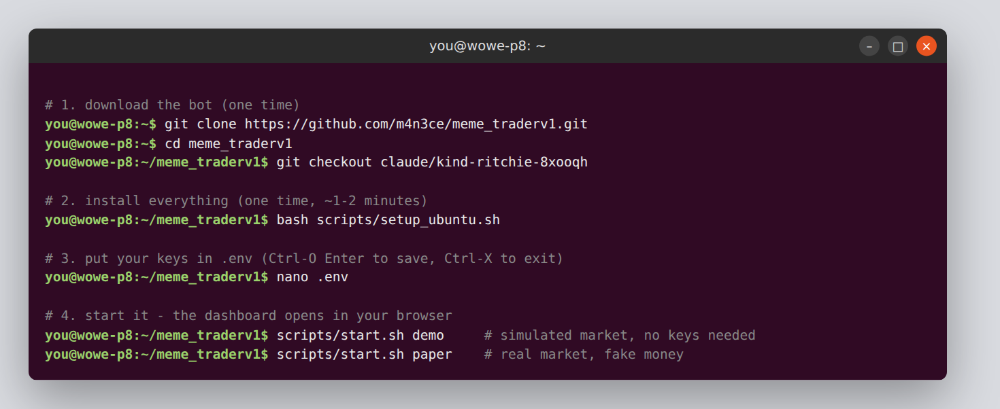

# Ubuntu setup: home mini PC (WOWE P8), running 24/7

This guide turns the mini PC into an always-on bot box that you can check from your Mac or phone.
Tested on **Ubuntu 24.04 LTS**. The setup script was run end-to-end on a fresh Ubuntu 24.04 machine.

> **The short version:** install Ubuntu 24.04, open Terminal, paste the lines in step 2, put your key in `.env`, then run `bash scripts/setup_ubuntu.sh --service`. Done: it runs 24/7 and restarts itself.



---

## 0. Install Ubuntu on the mini PC (skip if it's already on there)
1. On your Mac, download **Ubuntu 24.04 LTS Desktop** from ubuntu.com/download/desktop.
2. Write it to a USB stick (8 GB+) with **balenaEtcher** (etcher.balena.io).
3. Plug the stick into the P8. Power it on while tapping the boot-menu key. On mini PCs this is usually **F7, F11, F12 or Esc**; check the P8's manual if none of those work. Pick the USB stick.
4. Choose **Install Ubuntu**, then *Erase disk and install* (this wipes Windows), and create your user.
   - Tip: name the computer `wowe-p8`. That makes it reachable from the Mac as `wowe-p8.local`.

## 1. Open Terminal
Press **Ctrl + Alt + T**.

## 2. Download and install the bot
```bash
sudo apt update && sudo apt install -y git
cd ~
git clone https://github.com/m4n3ce/meme_traderv1.git
cd meme_traderv1
git checkout claude/kind-ritchie-8xooqh      # skip this line once the branch is merged into main
bash scripts/setup_ubuntu.sh
```
The script:
- installs anything missing (Python venv, pip, curl). It asks for your password once.
- installs the bot's packages into `.venv`;
- creates `.env`;
- runs the checker.

This is the real output from a fresh Ubuntu 24.04 machine:


*Captured on a cloud test machine with no access to pump.fun, which is why the PumpPortal websocket and RPC rows fail there. At home they show OK. *

## 3. Add your keys
If you already set up the Mac, just copy its `.env` across. Run this **on the Mac**:
```bash
scp ~/meme_traderv1/.env you@wowe-p8.local:~/meme_traderv1/.env
```
Or type the keys in on the P8:
```bash
nano .env
```


Paste your key after `PUMPPORTAL_API_KEY=` (right-click → Paste, or **Ctrl + Shift + V**). Then **Ctrl + O**, **Enter** to save, and **Ctrl + X** to exit.

Check:
```bash
scripts/start.sh doctor
```
For real-market paper trading, `PumpPortal websocket` and `trade logs` must say `[ OK ]`. No key is needed: the PumpPortal key is only for the optional metered trade stream (`sniper.feed.trades: pumpportal`).

## 4. Try it by hand first
```bash
scripts/start.sh demo     # simulated market; Firefox opens the dashboard
scripts/start.sh paper    # real market, fake money
```
The dashboard is at **http://127.0.0.1:8787**. Press **Ctrl + C** in the Terminal to stop.


## 5. Run it 24/7 as a service
```bash
bash scripts/setup_ubuntu.sh --service
```
This installs `meme-sniper` as a system service. It **starts at boot** and **restarts itself if it crashes**. It runs **paper trading** until you deliberately switch it to live.

| Do this | Command |
|---|---|
| Is it running? | `sudo systemctl status meme-sniper` |
| Watch its live log | `journalctl -u meme-sniper -f` (Ctrl + C to stop watching) |
| Restart (after editing `.env` or settings) | `sudo systemctl restart meme-sniper` |
| Stop | `sudo systemctl stop meme-sniper` |
| Don't start at boot any more | `sudo systemctl disable --now meme-sniper` |

**Stop the PC from sleeping.** The bot can't trade while the PC is asleep:
```bash
sudo systemctl mask sleep.target suspend.target hibernate.target hybrid-sleep.target
```
Or go to Settings → Power → set **Automatic Suspend** to **Off**.

## 6. Check on it from your Mac
On the P8, one time:
```bash
sudo apt install -y openssh-server
```
Then on the **Mac**, open Terminal and run:
```bash
ssh -L 8787:127.0.0.1:8787 you@wowe-p8.local
```
Leave that window open, and browse to **http://127.0.0.1:8787** on the Mac. You'll see the P8's dashboard.

Why the tunnel: the dashboard only listens on the P8 itself, because its buttons can sell positions. The SSH tunnel is the safe way in. Don't open port 8787 on your router.

## 7. Bring your Mac's recorded data across (optional)
Run this on the **Mac**:
```bash
scp ~/meme_traderv1/data/feed-* you@wowe-p8.local:~/meme_traderv1/data/
```
Backtests and the `leaders` command on the P8 then cover both machines' recordings.

## Updating to my latest changes
```bash
cd ~/meme_traderv1
git pull
bash scripts/setup_ubuntu.sh
sudo systemctl restart meme-sniper
```

## Going live (later, after reviewing paper results together)
Follow [SETUP.md step 5](SETUP.md#5-going-live-real-money): dedicated bot wallet, paid RPC, `MEME_TRADER_CONFIRM_LIVE=yes`. Then, for the service:
```bash
sudo sed -i 's|sniper run$|sniper run --live|' /etc/systemd/system/meme-sniper.service
sudo systemctl daemon-reload && sudo systemctl restart meme-sniper
```

## Troubleshooting
| Problem | Fix |
|---|---|
| `Permission denied` running a script | `chmod +x scripts/*.sh` |
| `wowe-p8.local` not found from the Mac | Use the P8's IP instead. Find it on the P8 with `hostname -I` |
| Service keeps restarting | `journalctl -u meme-sniper -n 50` shows the error. Usually a missing key in `.env` |
| "Address already in use" | The service is already running. `sudo systemctl stop meme-sniper` before running `start.sh` by hand |
| Want to run the demo while the service runs | `scripts/start.sh demo --port 8788` and open http://127.0.0.1:8788 |
